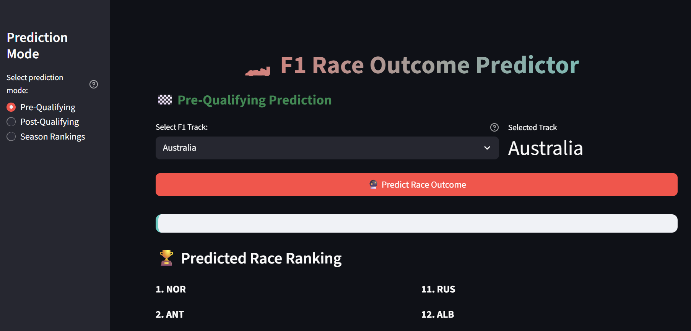

# F1 Race Outcome Predictor 🏎️ 

[Try it!](https://yarno97x-finishline-main-rcm3ar.streamlit.app/)

The **F1 Race Outcome Predictor** uses machine learning to predict Formula 1 race results.  
It leverages both **Neural Networks** and **Random Forests**, trained on historical race data (drivers, teams, qualifying sessions, and past race performances).  

The tool supports three prediction modes:  
- **Pre-Qualifying** → Estimate race outcomes before qualifying sessions  
- **Post-Qualifying** → Predictions refined with qualifying results  
- **Season Projections** → Forecast long-term outcomes across a season  

---

## Features
- Predict driver finishing positions using ML models   
- Multiple prediction modes (Pre-Q, Post-Q, Season)  
- Modular pipeline for data preprocessing and training  

---

## Tech Stack
- Python 3.10+  
- scikit-learn (Random Forests, preprocessing)  
- pandas / numpy (data wrangling)  
- matplotlib / seaborn (visualization, optional)  

